# Learning Flask: A Detailed Step-by-Step Guide

This guide focuses only on Flask. It assumes you already understand Python syntax, functions, classes, modules, virtual environments, exceptions, decorators, and basic HTTP concepts.

The examples use modern Flask patterns and are designed to be followed in order.

## What Is Flask?

Flask is a lightweight Python web framework for building web applications and HTTP APIs. It is built around Werkzeug, which handles the WSGI web interface and request/response utilities, and Jinja, which renders HTML templates.

Flask is often described as a microframework. That does not mean it can only build small applications. It means Flask gives you a small core and lets you choose the database layer, form library, authentication system, task queue, and other extensions that fit your application.

### Why Is Flask Needed?

Without a web framework, an application would need to handle HTTP parsing, URL matching, response construction, cookies, sessions, template rendering, error handling, and development serving directly. Flask provides the common web layer so you can focus on the application's behavior.

Flask is useful when you need to:

- Build a server-rendered website.
- Create a JSON or REST-style API.
- Add a web interface to an existing Python service.
- Build a prototype quickly and grow it gradually.
- Create a small internal tool or dashboard.
- Keep architectural choices under your control.

### How Flask Fits Together

```text
Browser or API client
    |
    v
Flask development server or production WSGI server
    |
    v
URL routing -> view function -> application/service logic
                  |
        +-------------+-------------+
        v                           v
      HTML template                 Database/API
        |
        v
      HTTP response
```

The central Flask flow is simple:

1. A client sends an HTTP request.
2. Flask matches the method and URL to a route.
3. The view function reads request data and calls application logic.
4. The view returns HTML, JSON, a redirect, or an error response.
5. Flask sends the response back to the client.

### Advantages of Flask

- **Simple core:** You can understand the main request flow without learning a large framework first.
- **Flexible architecture:** You choose extensions and project boundaries instead of adopting one mandatory structure.
- **Fast development:** A route and response can be created with only a few lines.
- **Good Python integration:** Flask works naturally with Python libraries and services.
- **Suitable for APIs and web pages:** The same application can serve HTML and JSON.
- **Easy to test:** Flask's test client can call routes without starting a real network server.
- **Large ecosystem:** Extensions exist for databases, authentication, forms, migrations, caching, and more.
- **Gradual growth:** A small application can later use blueprints, factories, services, and background workers.

### Disadvantages and Tradeoffs

- **You must make more decisions:** Database access, authentication, validation, and project structure are not all built into the core.
- **Architecture can become inconsistent:** Without conventions, a growing application can turn into one large routes file.
- **Extension compatibility varies:** Extensions are maintained independently, so versions and quality should be evaluated.
- **More setup for large teams:** Teams may need to define their own conventions for services, schemas, errors, and configuration.
- **Async workloads need deliberate design:** Flask supports async views, but high-concurrency or long-running workloads may be better served by a framework and deployment model designed around async execution.
- **Production still needs surrounding services:** A production WSGI server, reverse proxy or platform, database, logging, monitoring, and deployment process are separate concerns.

Flask is a strong choice when explicit control and a small core are valuable. A more opinionated framework may be preferable when a large team needs a standard structure and many built-in features immediately.

## Complete Video Lesson Transcript

This transcript can be used as a full lesson script. It follows the same order as the code in this repository and assumes Python fundamentals are already known.

### Flask Course Mind Map

Use this overview as the first presentation slide. It shows how the course moves from the request lifecycle to a production-ready application.

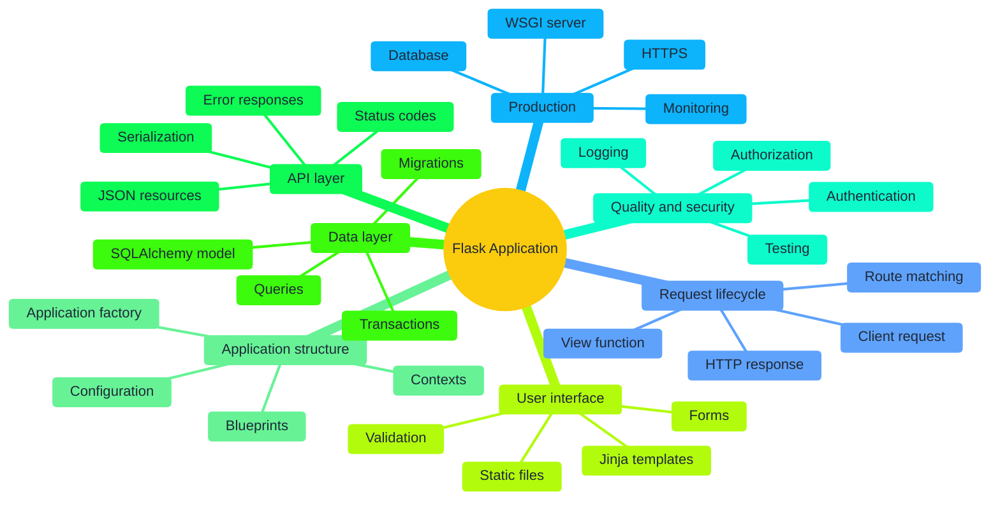

### Chapter 1: The Goal

**Instructor:** Welcome. In this lesson we will build a complete Todo application with Flask. We will use server-rendered HTML for the browser, SQLite for persistence, and JSON endpoints for API clients. By the end, a user will be able to create, complete, edit, and delete tasks, and the same data will be available through an API.

**Instructor:** Flask is needed because it gives us the web application layer: routing, request objects, responses, templates, sessions, and a development server. It does not force us to use a particular database or application architecture. That flexibility is useful, but it also means we must choose and document those pieces ourselves.

### Chapter 2: Project Setup

**Instructor:** We begin with an isolated environment and install Flask, Flask-SQLAlchemy, and pytest. Flask handles HTTP and templates. Flask-SQLAlchemy connects Flask to SQLAlchemy, which maps Python model classes to database tables. Pytest will verify behavior through the Flask test client.

**Instructor:** The project uses an application factory called `create_app`. A factory creates the application when requested. This matters because tests can create a separate application with a temporary database, and production can load production configuration without changing source code.

### Chapter 3: The First Route

**Instructor:** A route is a rule that maps an HTTP method and URL to a Python function. Our home route responds to `GET /`. When the browser requests that URL, Flask finds the route, calls its view function, and turns the return value into an HTTP response.

**Instructor:** We will use a blueprint for Todo routes. A blueprint is a collection of related routes that can be registered on an application. It keeps the application factory small and lets us separate browser pages from API routes.

### Chapter 4: Templates and Static Files

**Instructor:** Returning a string is useful for the first test, but a real browser page needs a template. Jinja templates let us create a base layout once and fill in page-specific blocks. We pass tasks from the view to the template, loop over them, and render a form for creating a new task.

**Instructor:** CSS belongs in the static directory. Flask's `url_for` function generates the correct URL for both routes and static files. We use `url_for` instead of hard-coded links so URL changes do not require editing every template.

### Chapter 5: The Data Model

**Instructor:** A Todo item needs an ID, a title, a completion flag, and timestamps. The `Todo` model describes those fields. SQLite stores the records in a local file, which makes this project easy to run. In a larger deployment, the same model pattern can point to PostgreSQL or another production database.

**Instructor:** The application creates tables when the app is initialized for this learning project. Real production applications should use migrations so schema changes are tracked and applied safely.

### Chapter 6: Creating and Reading Tasks

**Instructor:** The browser sends a `POST` request when the user submits the form. The view reads the `title` field, trims whitespace, validates its length, creates a model, adds it to the session, and commits the transaction.

**Instructor:** After a successful POST, we redirect back to the list page. This is the Post/Redirect/Get pattern. If the user refreshes the page, the browser repeats the GET instead of submitting the form again.

### Chapter 7: Updating and Deleting Tasks

**Instructor:** Completing a task is a state change, so it uses POST rather than GET. The route loads the task by ID, changes its `completed` field, commits, and redirects. Editing follows the same pattern but validates the replacement title first.

**Instructor:** Deletion also uses POST. The route returns a 404 response when the requested task does not exist. This is important because it gives the client a meaningful status instead of silently pretending that an invalid request succeeded.

### Chapter 8: The JSON API

**Instructor:** The API exposes the same Todo data under `/api/todos`. `GET` returns a JSON list. `POST` reads a JSON body and creates a task. `PATCH` changes a task's title or completion state. `DELETE` removes it.

**Instructor:** The browser pages and the API share the model, but they return different representations. The browser receives HTML and redirects. The API receives and returns JSON with explicit status codes. This is a useful example of keeping application data separate from presentation.

### Chapter 9: Errors and Validation

**Instructor:** Validation belongs at the boundary where untrusted input enters the application. An empty title is rejected before a database record is created. Invalid JSON receives a 400 response. A missing task receives a 404 response. Unexpected failures should be logged privately and should not expose stack traces in production.

### Chapter 10: Testing the Integration

**Instructor:** The tests create an app configured with a temporary SQLite database. They use the test client to create a Todo through the HTML endpoint, read it through the API, update it, and delete it. This is an end-to-end application test because it crosses routing, validation, database persistence, and response serialization.

### Chapter 11: Production Thinking

**Instructor:** The Flask development server is for local development. Production needs a WSGI server, secure configuration, HTTPS, a managed database, logging, monitoring, and a migration process. Debug mode must be disabled. Secrets must come from the environment or a secret manager.

**Instructor:** The important lesson is not only how to write a route. It is how a request travels through the complete application: client, route, validation, model, database, response, and test. That is the foundation you can reuse for larger Flask systems.

## What You Will Build

By the end, you will understand how to build and structure a Flask application with:

- Routes and URL variables
- Request data and response objects
- Templates with Jinja
- Static files
- HTML forms and validation
- JSON APIs
- Error handling
- Blueprints
- Application factories
- Configuration
- Database access with Flask-SQLAlchemy
- Authentication concepts
- Testing
- Production deployment

## 1. Install Flask and Create a Project

Create a project directory and activate a virtual environment using the Python tooling you already know. Then install Flask:

```bash
pip install Flask
```

Create this initial structure:

```text
flask-learning/
├── app/
│   ├── __init__.py
│   └── routes.py
├── run.py
└── requirements.txt
```

Save the installed dependency:

```bash
pip freeze > requirements.txt
```

A Flask application is not required to follow one fixed directory layout. The important idea is to keep application code, configuration, templates, static assets, and tests organized as the project grows.

## 2. Create the Smallest Flask Application

Create `app/__init__.py`:

```python
from flask import Flask


def create_app():
    app = Flask(__name__)

    from . import routes
    app.register_blueprint(routes.main)

    return app
```

Create `app/routes.py`:

```python
from flask import Blueprint

main = Blueprint("main", __name__)


@main.get("/")
def home():
    return "Hello, Flask!"
```

Create `run.py`:

```python
from app import create_app

app = create_app()


if __name__ == "__main__":
    app.run(debug=True)
```

Run it:

```bash
python run.py
```

Open `http://127.0.0.1:5000/` in a browser.

### What Happens During a Request

1. The development server receives an HTTP request.
2. Flask compares the request path and method with registered routes.
3. Flask calls the matching view function.
4. The return value becomes an HTTP response.
5. The browser displays the response.

`debug=True` enables automatic reloads and detailed error pages. Use it only during development.

## 3. Understand Routes and HTTP Methods

A route connects a URL pattern to a view function:

```python
@main.route("/about", methods=["GET"])
def about():
    return "About this application"
```

Flask provides method-specific decorators:

```python
@main.get("/products")
def products():
    return "Product list"


@main.post("/products")
def create_product():
    return "Product created", 201
```

Common HTTP methods:

- `GET`: retrieve a resource
- `POST`: create a resource or submit data
- `PUT`: replace a resource
- `PATCH`: partially update a resource
- `DELETE`: remove a resource

A route should use the method that matches the operation it performs. This improves API clarity and prevents accidental changes from a normal page visit.

## 4. Use URL Variables

Dynamic URL segments are declared with angle brackets:

```python
@main.get("/users/<username>")
def profile(username):
    return f"Profile for {username}"
```

Typed converters validate and convert the value before calling the function:

```python
@main.get("/orders/<int:order_id>")
def order_details(order_id):
    return f"Order number {order_id}"
```

Useful converters include:

- `string`: default text converter
- `int`: integer values
- `float`: decimal values
- `path`: text that may contain slashes
- `uuid`: UUID values

If a value does not match its converter, Flask returns a 404 response.

## 5. Return Proper Responses

A view can return more than a string:

```python
@main.get("/status")
def status():
    return {"status": "ok"}, 200
```

Returning a dictionary or list automatically creates a JSON response in modern Flask.

For explicit control, use `jsonify`:

```python
from flask import jsonify


@main.get("/api/health")
def health():
    return jsonify({"status": "ok"}), 200
```

You can return a response body, status code, and headers:

```python
from flask import make_response


@main.get("/download-info")
def download_info():
    response = make_response("File information")
    response.headers["X-Application"] = "Flask Learning App"
    return response
```

Use `redirect` when the client should visit another URL:

```python
from flask import redirect, url_for


@main.get("/start")
def start():
    return redirect(url_for("main.home"))
```

`url_for` is preferable to hard-coding URLs because it continues to work when routes change.

## 6. Read Query Parameters and Form Data

For a URL such as `/search?q=flask&page=2`, use `request.args`:

```python
from flask import request


@main.get("/search")
def search():
    query = request.args.get("q", "")
    page = request.args.get("page", default=1, type=int)
    return {"query": query, "page": page}
```

For submitted form fields, use `request.form`:

```python
@main.post("/contact")
def contact():
    name = request.form.get("name", "").strip()
    message = request.form.get("message", "").strip()

    if not name or not message:
        return {"error": "Name and message are required"}, 400

    return {"message": "Contact request received"}, 201
```

For JSON request bodies:

```python
@main.post("/api/products")
def create_product():
    data = request.get_json(silent=True) or {}
    name = data.get("name")

    if not name:
        return {"error": "name is required"}, 400

    return {"name": name}, 201
```

Use `silent=True` when malformed JSON should be handled by your own validation instead of raising an automatic parsing error.

## 7. Render HTML Templates

Add this structure:

```text
app/
├── __init__.py
├── routes.py
└── templates/
    ├── base.html
    └── home.html
```

Create `app/templates/base.html`:

```html
<!doctype html>
<html lang="en">
<head>
    <meta charset="utf-8">
    <meta name="viewport" content="width=device-width, initial-scale=1">
    <title>Flask App</title>
</head>
<body>
    <header>
        <a href="{{ url_for('main.home') }}">Home</a>
    </header>

    <main>
        
    </main>
</body>
</html>
```

Create `app/templates/home.html`:

```html


Home


    <h1>Welcome to Flask</h1>
    <p>{{ message }}</p>

```

Update the route:

```python
from flask import Blueprint, render_template

main = Blueprint("main", __name__)


@main.get("/")
def home():
    return render_template("home.html", message="Your first template is working.")
```

### Jinja Concepts You Need

Variable output:

```html
{{ user.name }}
```

Conditionals:

```html

    <p>Products are available.</p>

    <p>No products found.</p>

```

Loops:

```html
<ul>

    <li>{{ product.name }}</li>

</ul>
```

Jinja escapes HTML by default. Keep that behavior unless you have a specific, reviewed reason to mark content as safe.

## 8. Add Static CSS and JavaScript

Create:

```text
app/
└── static/
    ├── css/
    │   └── app.css
    └── js/
        └── app.js
```

Reference files in a template:

```html
<link rel="stylesheet" href="{{ url_for('static', filename='css/app.css') }}">
<script src="{{ url_for('static', filename='js/app.js') }}" defer></script>
```

Flask serves static files from the `static` directory during development. For production, a dedicated web server or platform should usually serve them.

## 9. Build an HTML Form

Template:

```html
<form method="post" action="{{ url_for('main.contact') }}">
    <label for="email">Email</label>
    <input id="email" name="email" type="email" required>

    <label for="message">Message</label>
    <textarea id="message" name="message" required></textarea>

    <button type="submit">Send</button>
</form>
```

Route:

```python
from flask import flash, redirect, render_template, request, url_for


@main.route("/contact", methods=["GET", "POST"])
def contact():
    if request.method == "POST":
        email = request.form.get("email", "").strip()
        message = request.form.get("message", "").strip()

        if not email or not message:
            flash("Email and message are required.", "error")
        else:
            flash("Your message was received.", "success")
            return redirect(url_for("main.contact"))

    return render_template("contact.html")
```

The redirect after a successful POST implements the Post/Redirect/Get pattern. It prevents a browser refresh from submitting the form again.

To use `flash`, configure a secret key:

```python
app.config["SECRET_KEY"] = "development-only-value"
```

Use an environment variable for the real secret in any shared or deployed environment.

## 10. Handle Errors

Register application-specific error pages:

```python
from flask import render_template


@main.app_errorhandler(404)
def page_not_found(error):
    return render_template("errors/404.html"), 404


@main.app_errorhandler(500)
def internal_error(error):
    return render_template("errors/500.html"), 500
```

You can also abort from a view:

```python
from flask import abort


@main.get("/admin")
def admin():
    user_is_admin = False

    if not user_is_admin:
        abort(403)

    return "Admin area"
```

Do not expose stack traces, secrets, database details, or internal paths in production error responses. Log the details privately instead.

## 11. Understand Application and Request Contexts

Flask uses contexts to make objects such as `request`, `session`, `current_app`, and `g` available during a request.

```python
from flask import current_app, g, request
```

- `request` represents the current HTTP request.
- `session` stores signed client-side session data.
- `current_app` points to the active Flask application.
- `g` stores temporary data for the current application context or request.

This works inside a request:

```python
@main.get("/debug-info")
def debug_info():
    return {
        "method": request.method,
        "application_name": current_app.name,
    }
```

It does not work outside an active context unless you create one:

```python
with app.app_context():
    print(current_app.config["SECRET_KEY"])
```

A common pattern is loading a resource once per request:

```python
@main.before_app_request
def load_current_user():
    g.current_user = None
```

Use `g` for request-scoped data, not as a general-purpose global store.

## 12. Configure the Application

Create a configuration class:

```python
import os


class Config:
    SECRET_KEY = os.environ.get("SECRET_KEY", "dev-only-secret")
    TESTING = False
```

Load it in the factory:

```python
def create_app(config_class=Config):
    app = Flask(__name__)
    app.config.from_object(config_class)

    from . import routes
    app.register_blueprint(routes.main)

    return app
```

Use separate configurations for development and tests:

```python
class TestConfig(Config):
    TESTING = True
    WTF_CSRF_ENABLED = False
```

Important configuration principles:

- Keep secrets out of source control.
- Use environment variables or a secret manager.
- Make test configuration deterministic.
- Keep production settings different from development settings.
- Do not rely on debug mode for application behavior.

## 13. Organize Routes with Blueprints

A blueprint groups related routes. Example structure:

```text
app/
├── __init__.py
├── main/
│   ├── __init__.py
│   └── routes.py
└── api/
    ├── __init__.py
    └── routes.py
```

Create `app/api/__init__.py`:

```python
from flask import Blueprint

api = Blueprint("api", __name__, url_prefix="/api")

from . import routes
```

Create `app/api/routes.py`:

```python
from . import api


@api.get("/health")
def health():
    return {"status": "ok"}
```

Register it in the factory:

```python
from .api import api

app.register_blueprint(api)
```

The endpoint is now available at `/api/health`.

Blueprints help separate features such as authentication, admin pages, users, and APIs without creating one large routes file.

## 14. Use an Application Factory

The `create_app` function is an application factory. It creates and configures a Flask instance when called.

A more complete version looks like this:

```python
from flask import Flask


def create_app(config_object=None):
    app = Flask(__name__)
    app.config.from_object(config_object or "config.Config")

    from .api import api
    from .main import main

    app.register_blueprint(main)
    app.register_blueprint(api)

    return app
```

Factories are important because they allow you to:

- Create separate app instances for tests.
- Use different configuration objects.
- Avoid work at import time.
- Support multiple application instances.
- Keep extension initialization separate from app creation.

When using the Flask CLI, expose the factory:

```bash
flask --app "app:create_app()" run --debug
```

## 15. Add a Database with Flask-SQLAlchemy

Install the extension:

```bash
pip install Flask-SQLAlchemy
```

Create `app/extensions.py`:

```python
from flask_sqlalchemy import SQLAlchemy


db = SQLAlchemy()
```

Initialize it in the factory:

```python
from .extensions import db


def create_app(config_object=None):
    app = Flask(__name__)
    app.config.from_object(config_object or "config.Config")
    app.config["SQLALCHEMY_DATABASE_URI"] = "sqlite:///app.db"

    db.init_app(app)

    from . import models
    from .main import main
    app.register_blueprint(main)

    return app
```

Define a model:

```python
from .extensions import db


class Task(db.Model):
    id = db.Column(db.Integer, primary_key=True)
    title = db.Column(db.String(200), nullable=False)
    completed = db.Column(db.Boolean, default=False, nullable=False)
```

Create tables during development:

```python
with app.app_context():
    db.create_all()
```

Query and insert records:

```python
from flask import request

from .extensions import db
from .models import Task


@main.route("/tasks", methods=["GET", "POST"])
def tasks():
    if request.method == "POST":
        task = Task(title=request.form["title"])
        db.session.add(task)
        db.session.commit()

    all_tasks = db.session.execute(
        db.select(Task).order_by(Task.id.desc())
    ).scalars()

    return render_template("tasks.html", tasks=all_tasks)
```

### Database Rules

- Validate input before creating models.
- Use transactions for related changes.
- Call `commit()` only when the operation is valid.
- Roll back after a failed transaction.
- Use migrations for schema changes instead of repeatedly calling `create_all()`.
- Never build SQL with string concatenation from user input.

For migrations, learn Flask-Migrate after understanding models and normal database transactions.

## 16. Build a JSON API

A small API endpoint:

```python
@api.get("/tasks")
def list_tasks():
    tasks = db.session.execute(db.select(Task)).scalars()
    return {
        "items": [
            {"id": task.id, "title": task.title, "completed": task.completed}
            for task in tasks
        ]
    }
```

An API should define consistent behavior for:

- Request and response JSON shape
- Status codes
- Validation errors
- Authentication failures
- Missing resources
- Pagination
- Sorting and filtering

Example status codes:

- `200 OK`: successful read or update
- `201 Created`: successful creation
- `204 No Content`: successful deletion with no response body
- `400 Bad Request`: invalid request format or values
- `401 Unauthorized`: authentication is required or failed
- `403 Forbidden`: authenticated user lacks permission
- `404 Not Found`: resource does not exist
- `409 Conflict`: request conflicts with current state
- `422 Unprocessable Entity`: syntactically valid but invalid data
- `500 Internal Server Error`: unexpected server failure

## 17. Authentication and Authorization

Authentication answers: "Who is this user?"

Authorization answers: "What may this user do?"

A typical Flask authentication flow is:

1. Receive login credentials over HTTPS.
2. Find the user by a unique identifier.
3. Compare the password with a securely stored hash.
4. Store a user identifier in the session or issue a token.
5. Load the current user for later requests.
6. Check permissions before protected operations.
7. Clear the session during logout.

Never store plain-text passwords. Use a password hashing library such as Werkzeug's helpers:

```python
from werkzeug.security import check_password_hash, generate_password_hash

hashed_password = generate_password_hash("user-password")
password_is_valid = check_password_hash(hashed_password, "user-password")
```

For larger applications, evaluate Flask-Login for session-based authentication and a suitable token solution for APIs. Protect state-changing browser requests against CSRF and use secure cookie settings in production.

## 18. Test Flask Applications

Install pytest:

```bash
pip install pytest
```

Create `tests/conftest.py`:

```python
import pytest

from app import create_app


@pytest.fixture()
def app():
    app = create_app()
    app.config.update({
        "TESTING": True,
        "SECRET_KEY": "test-secret",
    })
    return app


@pytest.fixture()
def client(app):
    return app.test_client()
```

Create `tests/test_routes.py`:

```python
def test_home_page(client):
    response = client.get("/")

    assert response.status_code == 200
    assert b"Flask" in response.data


def test_missing_page_returns_404(client):
    response = client.get("/does-not-exist")

    assert response.status_code == 404
```

Run tests:

```bash
pytest
```

Test behavior at the HTTP boundary. Include successful requests, validation errors, unauthorized requests, missing records, and unexpected failure paths where appropriate.

## 19. Logging and Error Monitoring

Use Python's logging facilities rather than printing diagnostic data:

```python
import logging

logger = logging.getLogger(__name__)

logger.info("Task created", extra={"task_id": task.id})
```

Production logging should help answer:

- What request failed?
- Which user or request identifier was involved?
- Which route was called?
- What operation failed?
- What is the trace or correlation ID?

Do not log passwords, session secrets, access tokens, or unnecessary personal data.

## 20. Security Checklist

Before deploying a Flask application:

- Set a strong secret key through the environment.
- Disable debug mode.
- Run behind HTTPS.
- Configure secure, HTTP-only cookies.
- Add CSRF protection to browser forms.
- Validate and limit uploaded files.
- Escape untrusted output in templates.
- Use parameterized database queries or an ORM.
- Restrict CORS to known origins.
- Add authentication and authorization checks.
- Apply request size and rate limits where needed.
- Keep dependencies updated.
- Avoid exposing detailed production errors.
- Store secrets outside the repository.

## 21. Run with the Flask CLI

For a factory named `create_app`:

```bash
flask --app "app:create_app()" run --debug
```

Useful commands include:

```bash
flask --app "app:create_app()" routes
flask --app "app:create_app()" shell
```

The `routes` command lists registered routes. The `shell` command starts a shell with the application context available, which is useful for inspecting models and configuration.

## 22. Prepare for Production

The Flask development server is not a production server. A production deployment normally includes:

1. A WSGI server such as Gunicorn or Waitress.
2. A reverse proxy or managed hosting platform.
3. Environment-based configuration.
4. A production database.
5. Static file handling.
6. HTTPS and secure headers.
7. Logging and monitoring.
8. Health checks.
9. A repeatable build and migration process.

Example WSGI entry point:

```python
from app import create_app

app = create_app()
```

Example command with a WSGI server:

```bash
gunicorn "wsgi:app"
```

The exact server and command depend on your operating system and hosting platform.

## Complete End-to-End Todo Project

The repository includes a runnable project in [`todo_project`](todo_project). It combines the Flask concepts from this guide into one application:

- A factory creates and configures the Flask app.
- A blueprint serves browser pages under `/`.
- A second blueprint serves JSON under `/api`.
- Flask-SQLAlchemy persists Todo records in SQLite.
- Jinja renders the HTML interface.
- Forms support create, complete, edit, and delete operations.
- API clients can list, create, update, and delete the same records.
- Pytest verifies browser-to-database-to-API integration.

### Project Structure

```text
todo_project/
├── app/
│   ├── __init__.py          # Application factory and app configuration
│   ├── api.py               # JSON API routes
│   ├── extensions.py        # Shared SQLAlchemy extension
│   ├── models.py            # Todo database model
│   ├── web.py               # Browser routes and validation
│   ├── static/style.css     # Application styling
│   └── templates/           # Jinja HTML templates
├── tests/
│   ├── conftest.py          # Test app and temporary database
│   └── test_todo_app.py     # End-to-end integration tests
├── requirements.txt
└── run.py
```

### Run the Todo Project

From the repository root:

```bash
cd todo_project
python -m venv .venv
```

On Windows PowerShell:

```powershell
.\.venv\Scripts\python.exe -m pip install -r requirements.txt
.\.venv\Scripts\python.exe run.py
```

On macOS or Linux:

```bash
.venv/bin/python -m pip install -r requirements.txt
.venv/bin/python run.py
```

Open `http://127.0.0.1:5000/`. The SQLite database is created in `todo_project/instance/todo.sqlite3` the first time the application starts.

### Browser Features

The browser interface supports:

1. Creating a Todo with `POST /todos`.
2. Viewing all Todos with `GET /`.
3. Toggling completion with `POST /todos/<id>/toggle`.
4. Opening the edit form with `GET /todos/<id>/edit`.
5. Saving an edit with `POST /todos/<id>/edit`.
6. Deleting a Todo with `POST /todos/<id>/delete`.

The create and edit routes reject empty titles and titles longer than 200 characters. Successful form submissions redirect back to the list page, which follows the Post/Redirect/Get pattern.

### API Examples

List all Todos:

```powershell
Invoke-RestMethod http://127.0.0.1:5000/api/todos
```

Create a Todo:

```powershell
Invoke-RestMethod http://127.0.0.1:5000/api/todos `
        -Method Post `
        -ContentType "application/json" `
        -Body '{"title":"Study Flask blueprints"}'
```

Update a Todo:

```powershell
Invoke-RestMethod http://127.0.0.1:5000/api/todos/1 `
        -Method Patch `
        -ContentType "application/json" `
        -Body '{"completed":true}'
```

Delete a Todo:

```powershell
Invoke-RestMethod http://127.0.0.1:5000/api/todos/1 -Method Delete
```

The API returns `201` after creation, `200` after a successful update, `204` after deletion, `400` for invalid input, and `404` when a Todo does not exist.

### End-to-End Request Flow

For a browser create request:

```text
HTML form
    -> POST /todos
    -> web.create_todo
    -> validate and trim title
    -> Todo model
    -> SQLAlchemy session
    -> SQLite database
    -> redirect to GET /
    -> query Todo records
    -> render index.html
```

For an API update request:

```text
JSON client
    -> PATCH /api/todos/1
    -> api.update_todo
    -> parse and validate JSON
    -> load Todo model
    -> update and commit
    -> serialize Todo.to_dict()
    -> JSON response
```

Run the integration tests from inside `todo_project`:

```powershell
.\.venv\Scripts\python.exe -m pytest -q
```

The tests prove that a Todo created through the browser is visible through the API, that API update and delete operations persist correctly, and that invalid or missing resources return useful errors.

## 30-Minute Video Course Plan

This plan turns the guide into twelve focused videos. Each video is exactly 30 minutes, for a total course length of 6 hours. Python basics are intentionally excluded. Every video should contain a short explanation, a live coding section, a visible diagram, and a small checkpoint.

### Standard 30-Minute Format

Use the same rhythm in every recording:

| Time | Segment | What to do |
| --- | --- | --- |
| 0:00-3:00 | Context | State the problem and show the finished result. |
| 3:00-8:00 | Concept | Explain the Flask idea and vocabulary. |
| 8:00-20:00 | Live coding | Build one focused feature in the Todo project. |
| 20:00-25:00 | Diagram and walkthrough | Trace one request from client to response. |
| 25:00-28:00 | Test and troubleshoot | Demonstrate one success case and one failure case. |
| 28:00-30:00 | Recap | Summarize three points and give a short practice task. |

### Video 1: What Flask Is and How a Request Works

**Goal:** Explain Flask's purpose, the microframework idea, the request lifecycle, and when Flask is a good choice.

**Cover in 30 minutes:**

- 0:00-3:00: Show the completed Todo application and define the problem Flask solves.
- 3:00-8:00: Explain framework, web server, WSGI, route, view, request, and response.
- 8:00-15:00: Create the smallest Flask app with one `/` route.
- 15:00-20:00: Run the app and inspect a browser request.
- 20:00-25:00: Walk through the diagram below.
- 25:00-28:00: Test an existing route and a missing route.
- 28:00-30:00: Recap the request lifecycle and assign a `/health` route.

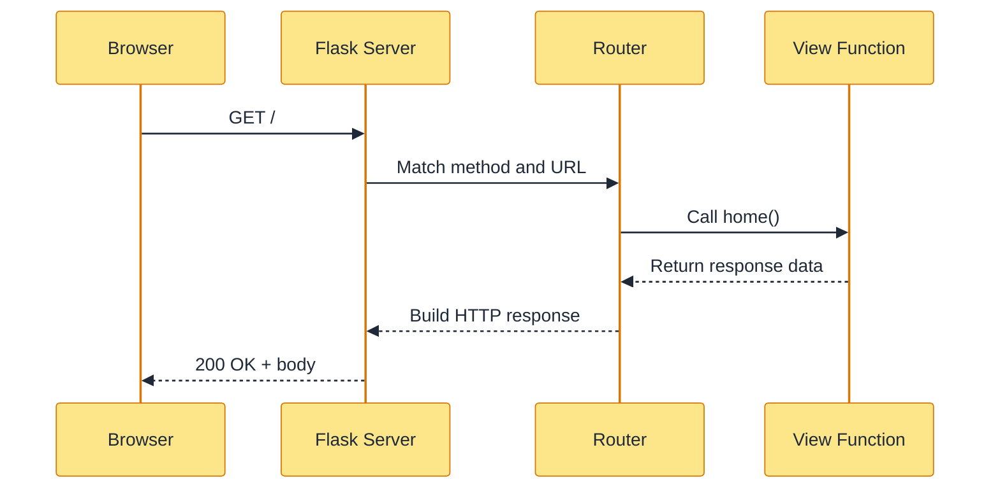

### Video 2: Project Setup, Application Factory, and Configuration

**Goal:** Create a maintainable Flask project and explain why `create_app` is better than putting all setup in one global object.

**Cover in 30 minutes:**

- 0:00-3:00: Compare a single-file app with the Todo project structure.
- 3:00-8:00: Explain packages, the instance folder, configuration, and environment variables.
- 8:00-16:00: Build `create_app`, load configuration, and initialize extensions.
- 16:00-20:00: Register blueprints from the factory.
- 20:00-25:00: Show development versus test configuration.
- 25:00-28:00: Create two app instances with different settings.
- 28:00-30:00: Recap and assign a test configuration change.

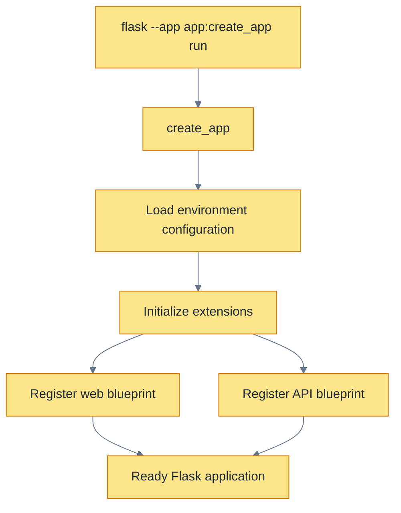

### Video 3: Routes, URL Variables, HTTP Methods, and Responses

**Goal:** Build predictable URLs and use HTTP methods and status codes correctly.

**Cover in 30 minutes:**

- 0:00-3:00: Show the Todo route table.
- 3:00-8:00: Explain route decorators, endpoint names, and `url_for`.
- 8:00-15:00: Add static routes, typed URL variables, redirects, and 404 behavior.
- 15:00-20:00: Compare GET, POST, PATCH, and DELETE with Todo operations.
- 20:00-25:00: Return HTML, JSON, status codes, and headers.
- 25:00-28:00: Test valid and invalid route requests.
- 28:00-30:00: Recap and assign an `/api/health` endpoint.

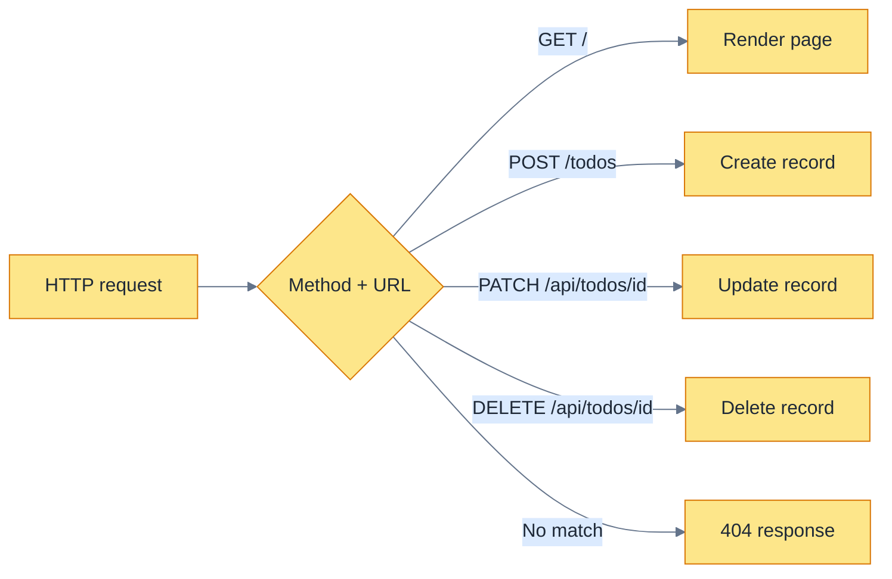

### Video 4: Request Data, Forms, Validation, and Redirects

**Goal:** Accept user input safely and implement the browser Todo workflow.

**Cover in 30 minutes:**

- 0:00-3:00: Submit the Todo form with valid and invalid values.
- 3:00-8:00: Explain `request.args`, `request.form`, and `request.get_json`.
- 8:00-15:00: Add create and edit forms with required fields and length checks.
- 15:00-20:00: Explain boundary validation and normalized input.
- 20:00-25:00: Demonstrate flash messages and Post/Redirect/Get.
- 25:00-28:00: Test empty, oversized, and valid titles.
- 28:00-30:00: Recap and assign a search query parameter.

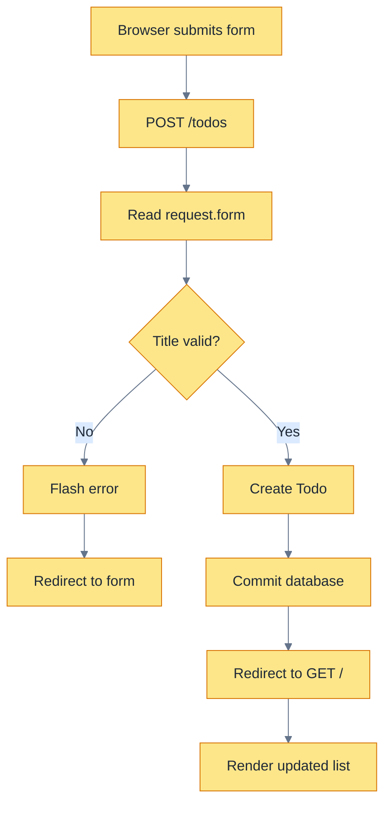

### Video 5: Jinja Templates, Layouts, and Static Files

**Goal:** Build reusable HTML pages with safe dynamic output and static assets.

**Cover in 30 minutes:**

- 0:00-3:00: Show the rendered Todo page and identify its parts.
- 3:00-8:00: Explain Jinja expressions, statements, loops, conditions, and escaping.
- 8:00-15:00: Build `base.html`, `index.html`, and `edit.html` with inheritance.
- 15:00-20:00: Pass Todo objects from a view to a template.
- 20:00-25:00: Add CSS through `url_for('static', ...)` and make the page responsive.
- 25:00-28:00: Demonstrate an empty list and a completed item.
- 28:00-30:00: Recap and assign a reusable navigation block.

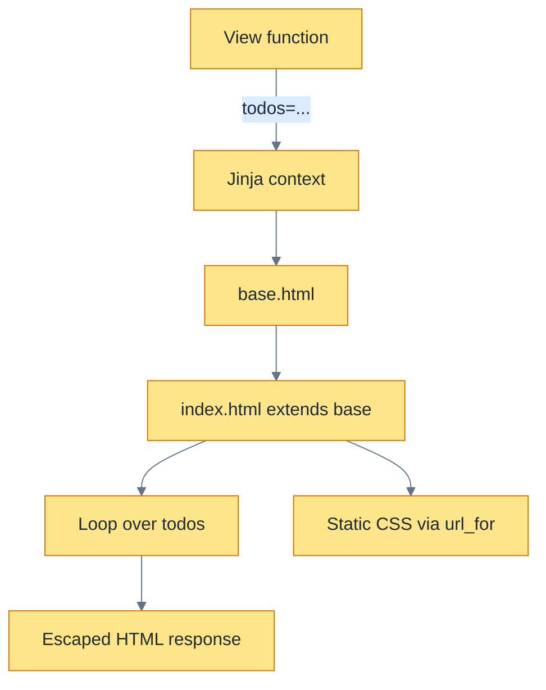

### Video 6: Databases, Models, Queries, and Transactions

**Goal:** Persist Todo data correctly using Flask-SQLAlchemy and understand the database session.

**Cover in 30 minutes:**

- 0:00-3:00: Restart the app and show that persisted tasks remain.
- 3:00-8:00: Explain tables, rows, columns, primary keys, and an ORM.
- 8:00-15:00: Define the `Todo` model and configure SQLite.
- 15:00-20:00: Insert, select, update, and delete records.
- 20:00-25:00: Explain session, commit, rollback, and why migrations matter.
- 25:00-28:00: Trigger a validation failure and verify no bad row is saved.
- 28:00-30:00: Recap and assign a priority field exercise.

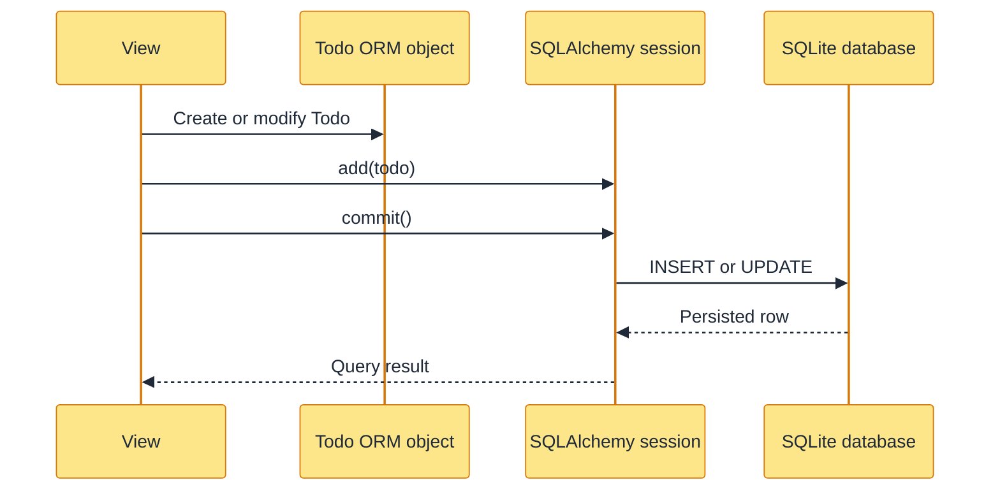

### Video 7: Blueprints, Application Context, and Request Context

**Goal:** Separate features and understand Flask's context-local objects.

**Cover in 30 minutes:**

- 0:00-3:00: Show why one large routes file becomes difficult to maintain.
- 3:00-8:00: Explain blueprint ownership, URL prefixes, and endpoint names.
- 8:00-15:00: Create and register separate web and API blueprints.
- 15:00-20:00: Explain `request`, `session`, `g`, and `current_app`.
- 20:00-25:00: Demonstrate an application context in a shell or test.
- 25:00-28:00: Diagnose an “outside application context” error.
- 28:00-30:00: Recap and assign a third blueprint.

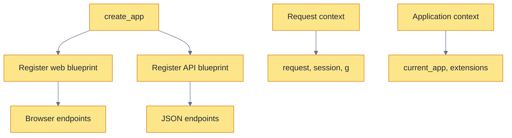

### Video 8: JSON APIs and REST-Style Design

**Goal:** Build a complete JSON API over the same Todo model.

**Cover in 30 minutes:**

- 0:00-3:00: Call the Todo API from PowerShell or an API client.
- 3:00-8:00: Explain resources, representations, content types, and status codes.
- 8:00-15:00: Implement list and create endpoints.
- 15:00-20:00: Implement patch and delete endpoints.
- 20:00-25:00: Add JSON validation, consistent errors, and serialization.
- 25:00-28:00: Demonstrate 200, 201, 204, 400, and 404 responses.
- 28:00-30:00: Recap and assign pagination design.

```mermaid
%%{init: {"theme":"base","themeVariables":{"primaryColor":"#FDE68A","primaryTextColor":"#1F2937","primaryBorderColor":"#D97706","lineColor":"#64748B","secondaryColor":"#DBEAFE","tertiaryColor":"#DCFCE7","fontFamily":"Georgia"}}}%%
flowchart LR
    A[JSON client] --> B[POST /api/todos]
    B --> C[Parse JSON]
    C --> D[Validate fields]
    D --> E[Todo model]
    E --> F[(Database)]
    F --> G[Todo.to_dict()]
    G --> H[201 JSON response]
```

### Video 9: Error Handling, Logging, and Security Boundaries

**Goal:** Make failures understandable to users and useful to developers without leaking private details.

**Cover in 30 minutes:**

- 0:00-3:00: Trigger an invalid input, missing Todo, and unexpected error.
- 3:00-8:00: Explain 4xx versus 5xx errors and custom error handlers.
- 8:00-15:00: Add browser and API-specific 404 responses.
- 15:00-20:00: Add structured logging and identify sensitive data to exclude.
- 20:00-25:00: Explain secret keys, HTTPS, CSRF, SQL injection, and output escaping.
- 25:00-28:00: Review the Todo project's security checklist.
- 28:00-30:00: Recap and assign a safe error response.

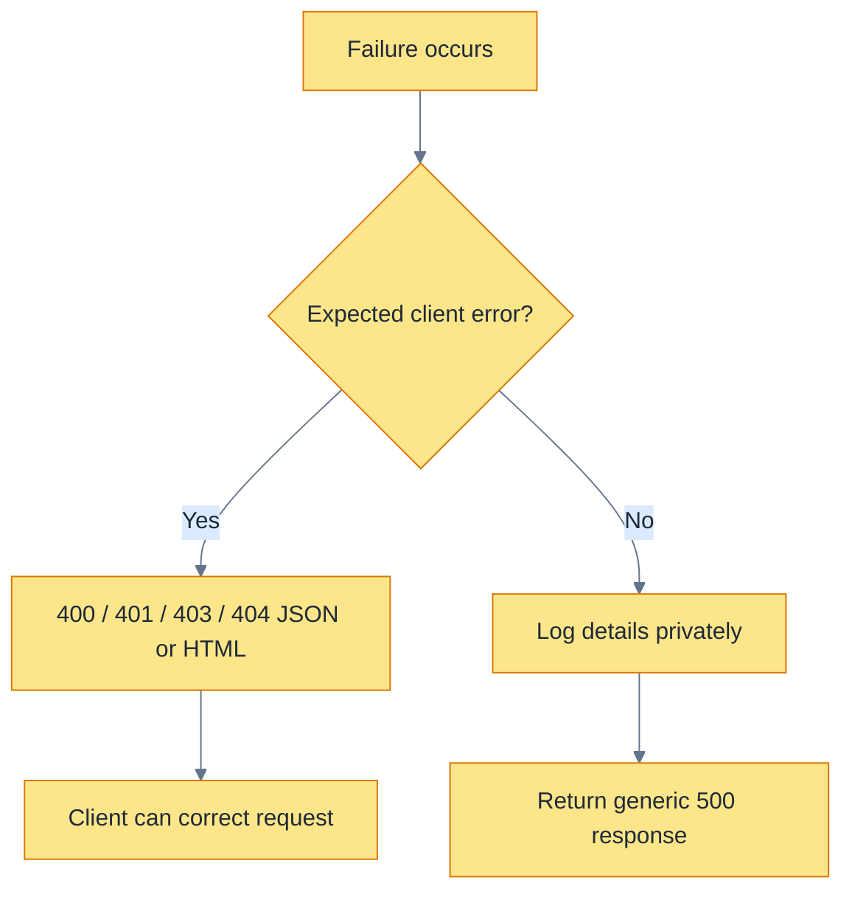

### Video 10: Authentication, Sessions, and Authorization

**Goal:** Explain identity and permissions and prepare the Todo project for user-owned tasks.

**Cover in 30 minutes:**

- 0:00-3:00: Show why a shared Todo list needs user identity.
- 3:00-8:00: Distinguish authentication from authorization.
- 8:00-15:00: Explain password hashing, login, logout, and session cookies.
- 15:00-20:00: Protect a route and load the current user.
- 20:00-25:00: Add ownership checks before reading or changing a Todo.
- 25:00-28:00: Discuss CSRF and secure cookie settings.
- 28:00-30:00: Recap and assign a protected `/profile` route.

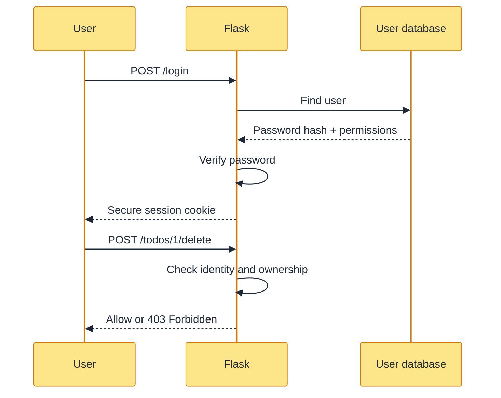

### Video 11: Testing, Debugging, and Integration

**Goal:** Prove the application works across routes, validation, persistence, and responses.

**Cover in 30 minutes:**

- 0:00-3:00: Run the existing Todo test suite.
- 3:00-8:00: Explain app fixtures, test clients, and temporary databases.
- 8:00-15:00: Write a browser-to-database-to-API integration test.
- 15:00-20:00: Add validation and missing-resource tests.
- 20:00-25:00: Debug a failing test and read the response body.
- 25:00-28:00: Discuss unit tests versus integration tests.
- 28:00-30:00: Recap and assign a test for toggling completion.

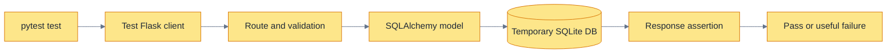

### Video 12: Production Deployment and Final Project Review

**Goal:** Understand what changes when a Flask application leaves local development.

**Cover in 30 minutes:**

- 0:00-3:00: Review the completed Todo application.
- 3:00-8:00: Explain development server versus production WSGI server.
- 8:00-15:00: Review environment configuration, database URLs, migrations, and secrets.
- 15:00-20:00: Explain HTTPS, reverse proxy, static files, health checks, and logs.
- 20:00-25:00: Walk through a deployment checklist and rollback plan.
- 25:00-28:00: Run final API and browser smoke tests.
- 28:00-30:00: Summarize the entire Flask request-to-database flow.

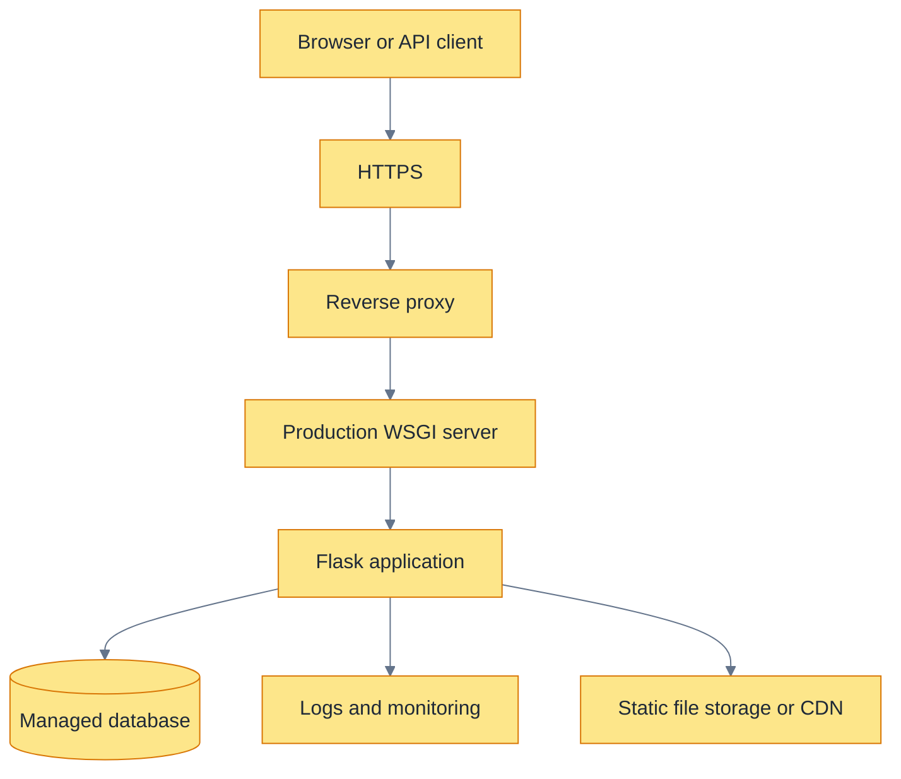

### Presentation Guidance

For each video, use this slide order:

1. **Problem:** What would be difficult without this Flask feature?
2. **Concept:** Define no more than five new terms.
3. **Diagram:** Show the request or data flow before coding.
4. **Implementation:** Add one feature to the Todo project.
5. **Failure case:** Show what happens with invalid input or a missing resource.
6. **Recap:** End with three key points and one practice task.

Keep diagrams visible while coding. Highlight the current step with a cursor, annotation, or animation, and return to the same diagram after the code runs. This gives learners a stable mental model instead of twelve unrelated code demonstrations.

## Recommended Learning Projects

Complete these in order:

1. **Hello Flask site**: routes, templates, static CSS, and navigation.
2. **Contact form**: POST requests, validation, flash messages, and redirects.
3. **Task manager**: database models, CRUD operations, and error handling.
4. **JSON API**: resource endpoints, status codes, validation, and pagination.
5. **Login system**: password hashing, sessions, protected routes, and logout.
6. **Blog application**: blueprints, relationships, pagination, authorization, and tests.
7. **Production project**: application factory, migrations, environment configuration, logging, deployment, and monitoring.

## Suggested Study Sequence

Study one section at a time and implement it before moving on:

1. Application creation and the request lifecycle
2. Routes, methods, URL variables, and redirects
3. Request data and response construction
4. Jinja templates and static files
5. Forms and validation
6. Error handling and contexts
7. Configuration and environment variables
8. Blueprints and application factories
9. Database models and transactions
10. JSON APIs and authentication
11. Testing and logging
12. Security and production deployment

For each topic, write a small feature, test its success path, test at least one failure path, and then refactor it into the project structure shown above.
